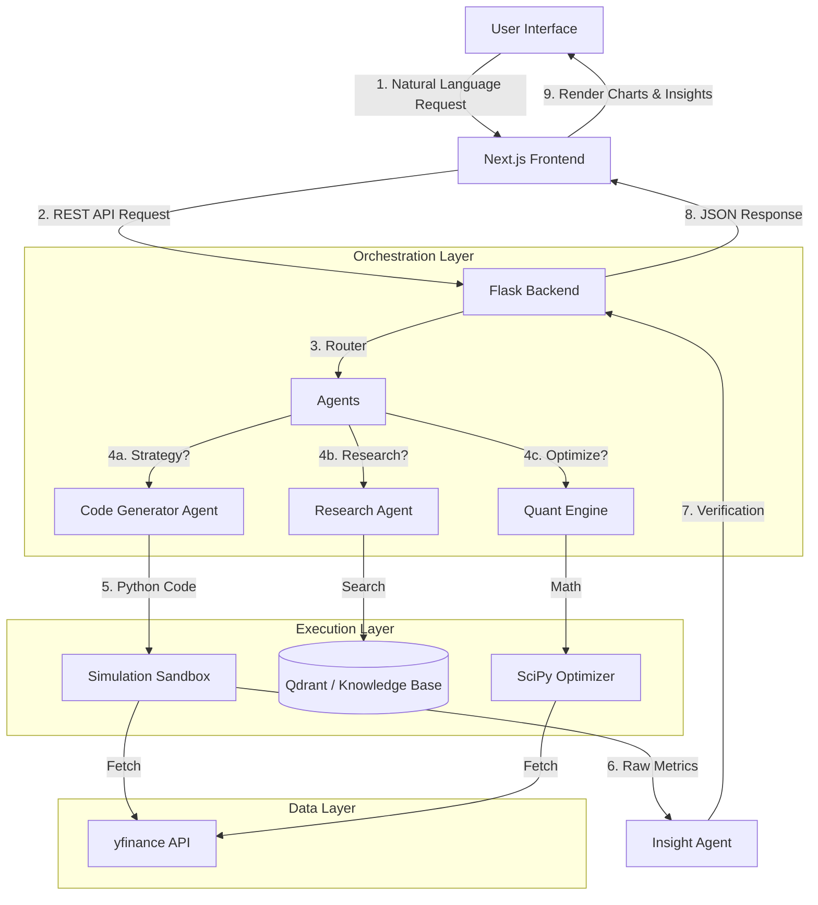

# FinSim 🚀  
### **The Intelligent Financial Simulation Engine**  
**Hack This Fall 2025 Submission by Team *brnch***

---

 


## 💡 The Problem: "The Financial Code Barrier"

We live in a world where financial literacy is higher than ever, yet **financial capability** remains low. 

Why? Because the tools required to rigorously test, validate, and simulate trading ideas are locked behind a massive technical wall.
*   **Hedge funds** have armies of quants and supercomputers.
*   **Retail investors** have "gut feelings" and basic charts.

To answer a simple question like *"What would have happened if I bought Apple every time it dropped 5%?"*, a typical user needs to know **Python**, **Pandas**, **API integration**, and **statistical analysis**. This exclusion prevents millions from validating their ideas before risking real capital.

## 🚀 The Solution: FinSim

**FinSim** destroys this barrier by treating **simulation as a language problem.**

It is an intelligent financial simulation platform that allows anyone to describe a trading strategy or market query in **plain English**. Our autonomous AI agents instantly convert your natural language into rigorous Python simulations, executable code, and deep research pipelines.

> **"If you can speak it, you can simulate it."**

---

## 🌟 Capabilities & Features

### 1. 🗣️ English-to-Simulation Engine (USP)
This is our flagship feature. We don't just use AI to chat; we use it to **code**.
*   **Input:** *"Buy NVDA when the 10-day SMA crosses above the 50-day SMA. Sell if it drops 10%."*
*   **Action:** The system generates a custom Python strategy class, fetches historical data, and executes a backtest.
*   **Output:** A professional report with Sharpe Ratio, Drawdown, and Win Rate metrics.

### 2. 🧠 Agentic RAG (Deep Research)
Markets move on fundamentals, not just price action.
*   **Contextual Search:** Uses **Qdrant** vector search to find relevant financial documents and news.
*   **Multi-Step Reasoning:** Breaks down complex questions (e.g., *"Why is the semiconductor sector down?"*) into sub-queries to provide a cited, fact-based answer.

### 3. ⚖️ Portfolio Optimization Suite
Mathematical rigor for your asset allocation.
*   **Efficient Frontier:** Uses Modern Portfolio Theory to find the mathematically optimal mix of assets.
*   **HRP (Hierarchical Risk Parity):** Uses machine learning clustering to build safer, more diversified portfolios.
*   **Kelly Criterion:** Calculates optimal position sizing to maximize long-term wealth.

### 4. 🎨 Designed for Accessibility
Financial data is dense. We designed FinSim to be clean, readable, and inclusive.
*   **High-Contrast Charts:** Ensuring data is visible for everyone.
*   **Plain English Explanations:** Every complex metric (like "Sharpe Ratio") is accompanied by an AI-generated explanation in simple terms.
*   **Responsive UI:** Fully functional on desktop and mobile.

---

## 🛠️ Architecture & Tech Stack

FinSim is built as a modular, high-performance web application designed for scalability and speed.

### **The Stack**
*   **Frontend:** [Next.js 15](https://nextjs.org/) (React) 
    *   Styled with **Tailwind CSS** and **Shadcn UI** for a clean, professional aesthetic.
    *   Uses **Recharts** and **Lightweight Charts** for high-performance financial visualizations.
*   **Backend:** [Flask](https://flask.palletsprojects.com/) (Python)
    *   Serves as the central orchestration layer.
    *   Manages the AI context window and tool execution.
*   **AI Intelligence:** [Google Gemini](https://deepmind.google/technologies/gemini/) 
    *   **Gemini 2.5 Flash:** Used for high-speed code generation and rapid reasoning.
*   **Data & Simulation:** 
    *   `yfinance`: Real-time and historical market data.
    *   `backtesting.py`: Event-driven backtesting engine.
    *   `scipy` & `numpy`: Heavy mathematical lifting for portfolio optimization.
    *   `Qdrant`: Vector database for RAG.

### **System Data Flow**



---

## 🔮 Roadmap: What's Next?

FinSim is just getting started. Here is our vision for the future:

*   **Paper Trading Integration:** Move from historical simulation to real-time practice trading without risking money.
*   **Community Strategy Hub:** A marketplace where users can share, fork, and improve each other's successful strategies.
*   **Crypto & Forex Support:** Expanding our data engine beyond US Equities to global markets.
*   **Mobile App:** A native experience for on-the-go simulation.

---

## 🚀 Getting Started

To run FinSim locally, follow these steps.

### Prerequisites
*   **Node.js** (v18 or higher)
*   **Python** (v3.9 or higher)
*   **Google Gemini API Key** (Get it from Google AI Studio)

### Installation

1.  **Clone the Repository**
    ```bash
    git clone https://github.com/your-repo/finsim.git
    cd finsim
    ```

2.  **Backend Setup**
    Navigate to the backend folder and set up the Python environment.
    ```bash
    cd backend
    
    # Create virtual environment
    python -m venv .venv
    
    # Activate it
    # On macOS/Linux:
    source .venv/bin/activate
    # On Windows:
    # .venv\Scripts\activate
    
    # Install dependencies
    pip install -r requirements.txt
    
    # Configure Environment
    # Create a .env file and add your key
    echo "GOOGLE_API_KEY=your_gemini_key_here" > .env
    
    # Start the Server
    python run.py
    ```
    *The backend will start on `http://localhost:3001`*

3.  **Frontend Setup**
    Open a new terminal window and navigate to the frontend app.
    ```bash
    cd frontend/apps/trader
    
    # Install dependencies (using pnpm is recommended)
    pnpm install
    
    # Start Development Server
    pnpm dev
    ```

4.  **Launch**
    Open your browser to `http://localhost:3000`. You're ready to simulate!

---

## 👥 Team *brnch*

We are a team of passionate developers building at the intersection of Finance and AI.

*   **Ayush Bohra** - *AI & Machine Learning*
    *   Designed the Agentic workflows, RAG pipeline, and Strategy Generation logic.
*   **Pradyut Das** - *Full Stack Engineering*
    *   Built the responsive Next.js frontend, interactive charting, and seamless API integration.
*   **Rishabh Jain** - *Cloud & DevOps*
    *   Managed the system architecture, scripting and automation.

---

## ⚠️ Disclaimer

**FinSim is a hackathon project created for educational and demonstration purposes only.**

*   We are **not** financial advisors.
*   The simulations, optimizations, and AI insights provided by this tool should **never** be interpreted as financial advice or a recommendation to buy/sell any asset.
*   **Past performance is not indicative of future results.** A strategy that worked in 2023 might fail in 2025.
*   Trading involves significant risk of loss. Always conduct your own due diligence.

---

*Built with 💻 and ☕ for Hack This Fall 2025.*